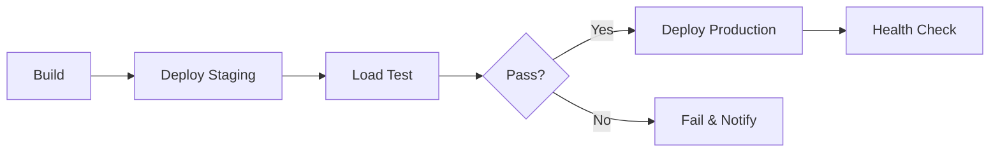

# 🎓 Contoso University - Resilience Demo

[](https://github.com/TeplrGuy/app-template-dotnet-azuresql-appsvc/actions/workflows/build-test-deploy.yml)

A .NET 6 MVC web application enhanced with **Azure Load Testing**, **Chaos Engineering**, and **AI-powered resilience workflows** using **GitHub Copilot**.

> 🚀 This repository demonstrates modern DevOps practices including performance testing gates, chaos experiments, and AI-assisted remediation.

## 🌟 Features

| Feature | Description |
|---------|-------------|
| 🧪 **Azure Load Testing** | Automated performance testing in CI/CD |
| 🔥 **Chaos Engineering** | Azure Chaos Studio experiments |
| 🤖 **AI-Powered Dev** | GitHub Copilot skills & prompts |
| 📊 **Observability** | Azure Monitor dashboards & alerts |
| 🔄 **Quality Gates** | Pass/fail criteria in pipelines |

## 📁 Project Structure

```
contoso-resilience-demo/
├── 📂 .github/
│   ├── 📂 workflows/           # CI/CD pipelines
│   │   └── build-test-deploy.yml
│   ├── 📂 skills/              # GitHub Copilot skills
│   │   ├── chaos-engineering.md
│   │   ├── load-testing-expert.md
│   │   ├── remediation-expert.md
│   │   └── sre-advisor.md
│   ├── 📂 prompts/             # Reusable Copilot prompts
│   │   ├── generate-load-test.prompt.md
│   │   ├── design-chaos-experiment.prompt.md
│   │   └── analyze-and-fix-error.prompt.md
│   └── copilot-instructions.md
├── 📂 src/
│   └── ContosoUniversity.WebApplication/
├── 📂 loadtests/               # Azure Load Testing
│   ├── contoso-load-test.jmx
│   ├── config.yaml
│   └── README.md
├── 📂 infra/
│   ├── 📂 chaos/               # Chaos Studio experiments
│   │   ├── experiments/
│   │   └── README.md
│   └── 📂 monitoring/          # Azure Monitor resources
│       ├── dashboard.json
│       └── alerts.bicep
└── README.md
```

## 🚀 Quick Start

### Prerequisites

- .NET 6 SDK
- Azure CLI
- GitHub CLI (optional)
- Azure subscription with:
  - App Service
  - Azure SQL Database
  - Azure Load Testing
  - Azure Chaos Studio (preview)

### Local Development

```bash
# Clone the repository
git clone https://github.com/TeplrGuy/app-template-dotnet-azuresql-appsvc.git
cd app-template-dotnet-azuresql-appsvc

# Restore and run
dotnet restore src/ContosoUniversity.WebApplication/ContosoUniversity.WebApplication.csproj
dotnet run --project src/ContosoUniversity.WebApplication/ContosoUniversity.WebApplication.csproj
```

### Azure Deployment

```bash
# Login to Azure
az login

# Create resources (use your values)
az group create --name rg-contoso --location eastus

# Deploy infrastructure
az deployment group create \
  --resource-group rg-contoso \
  --template-file infra/main.bicep
```

## 🧪 Load Testing

### Running Load Tests

```bash
# Local with JMeter
jmeter -n -t loadtests/contoso-load-test.jmx \
  -Jwebapp_url=https://your-app.azurewebsites.net \
  -Jconcurrent_users=50 \
  -Jduration_seconds=120

# Azure Load Testing via CLI
az load test run \
  --name contoso-load-test \
  --resource-group rg-contoso \
  --load-test-resource alt-contoso
```

### Pass/Fail Criteria

| Metric | Threshold | Action |
|--------|-----------|--------|
| p95 Response Time | < 2000ms | Fail build |
| Error Rate | < 1% | Fail build |
| p99 Response Time | < 4000ms | Warning |

## 🔥 Chaos Engineering

### Available Experiments

1. **SQL Latency** - Inject 500ms latency to database
2. **CPU Pressure** - Stress App Service to 80% CPU

### Running Experiments

```bash
# Start experiment
az chaos experiment start \
  --name sql-latency-experiment \
  --resource-group rg-contoso

# Monitor
az chaos experiment show \
  --name sql-latency-experiment \
  --resource-group rg-contoso
```

See [infra/chaos/README.md](infra/chaos/README.md) for detailed instructions.

## 🤖 GitHub Copilot Integration

### Skills

Use these with `@workspace` in Copilot Chat:

| Skill | Use For |
|-------|---------|
| **Chaos Engineering Expert** | Design failure scenarios |
| **Load Testing Expert** | Generate JMeter tests |
| **SRE Advisor** | SLO/SLI guidance |
| **Remediation Expert** | Fix errors from logs |

### Prompts

Reusable prompts in `.github/prompts/`:

1. **Generate Load Test** - Create JMeter test plans
2. **Design Chaos Experiment** - Create Chaos Studio experiments
3. **Analyze and Fix Error** - Debug issues from logs

## 📊 Observability

### Azure Monitor Dashboard

Deploy the pre-built dashboard:

```bash
az deployment group create \
  --resource-group rg-contoso \
  --template-file infra/monitoring/dashboard.json \
  --parameters appInsightsResourceId="/subscriptions/.../appInsights" \
               appServiceResourceId="/subscriptions/.../sites/contoso" \
               sqlDatabaseResourceId="/subscriptions/.../databases/contosodb"
```

### Key Metrics

- **Response Time (p95)** - Under 2 seconds
- **Error Rate** - Under 1%
- **Availability** - Above 99.9%
- **CPU Utilization** - Under 80%
- **Database DTU** - Under 70%

## 🔄 CI/CD Pipeline

The pipeline includes these stages:



### Required Secrets

| Secret | Description |
|--------|-------------|
| `AZURE_CREDENTIALS` | Service principal JSON |
| `AZURE_RESOURCE_GROUP` | Resource group name |
| `AZURE_LOAD_TEST_RESOURCE` | Load Testing resource name |
| `AZURE_SUBSCRIPTION_ID` | Azure subscription ID |

## 🛠️ Development

### Running Tests

```bash
dotnet test src/ContosoUniversity.Test/ContosoUniversity.Test.csproj
```

### Code Quality

```bash
dotnet format src/ContosoUniversity.WebApplication/ContosoUniversity.WebApplication.csproj
```

## 📚 Session Resources

This repository was enhanced for the session:

> **"Azure Load Testing & GitHub Copilot: AI-Powered Chaos Engineering & Resilience Validation"**

### Session Objectives

1. ✅ Design failure scenarios with GitHub Copilot
2. ✅ Generate load tests using AI
3. ✅ Integrate load testing into CI/CD
4. ✅ Run chaos experiments
5. ✅ Observe impact via Azure Monitor

### Demo Flow

1. **Show Application** - Browse Contoso University
2. **Generate Load Test** - Use Copilot prompt
3. **Run Load Test** - Azure Load Testing
4. **Design Chaos Experiment** - Use Copilot skill
5. **Inject Fault** - Run chaos experiment
6. **Observe Recovery** - Azure Monitor dashboard

## 📄 License

This project is licensed under the MIT License - see the [LICENSE](LICENSE) file for details.

## 🙏 Acknowledgments

- [Azure Load Testing Documentation](https://learn.microsoft.com/azure/load-testing/)
- [Azure Chaos Studio Documentation](https://learn.microsoft.com/azure/chaos-studio/)
- [GitHub Copilot Documentation](https://docs.github.com/copilot)
