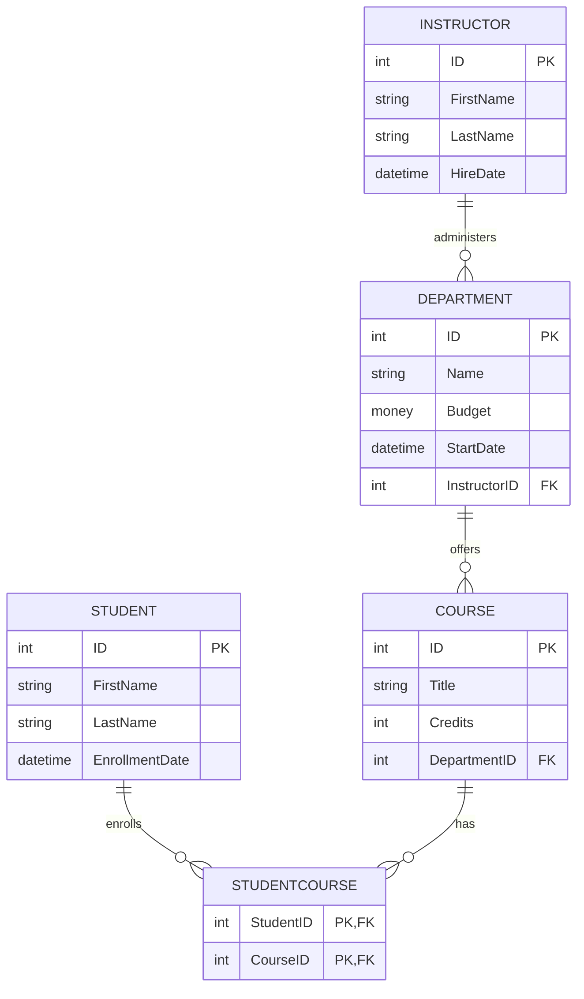
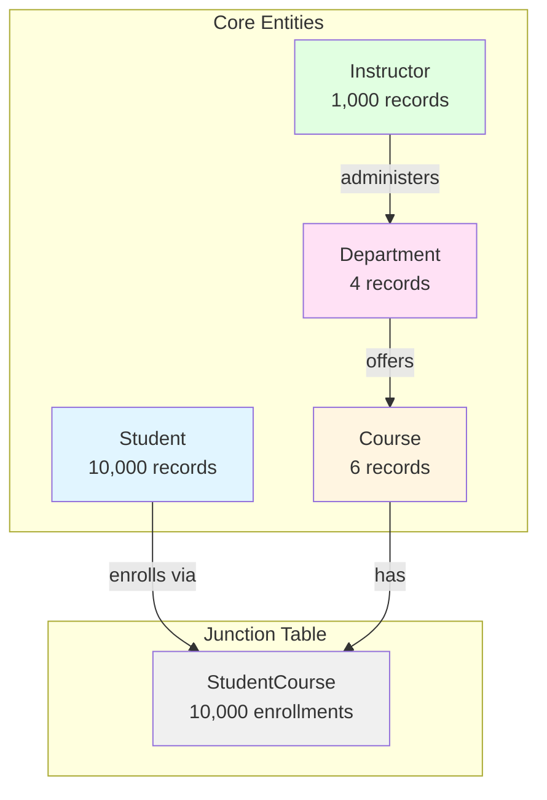
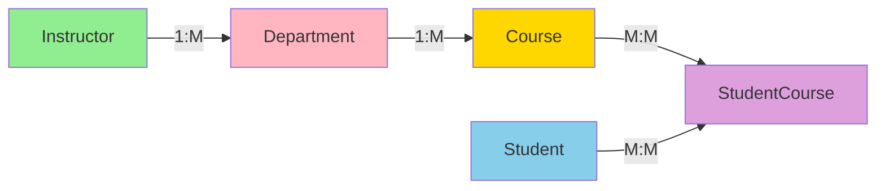
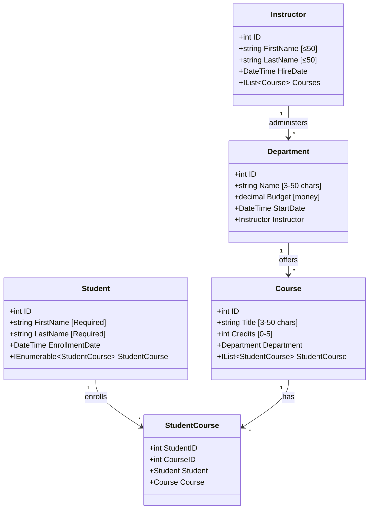
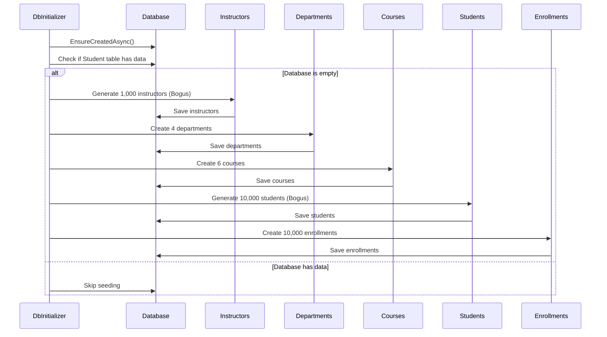
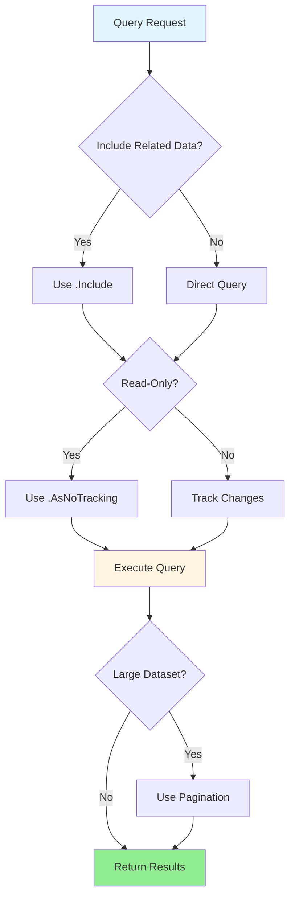
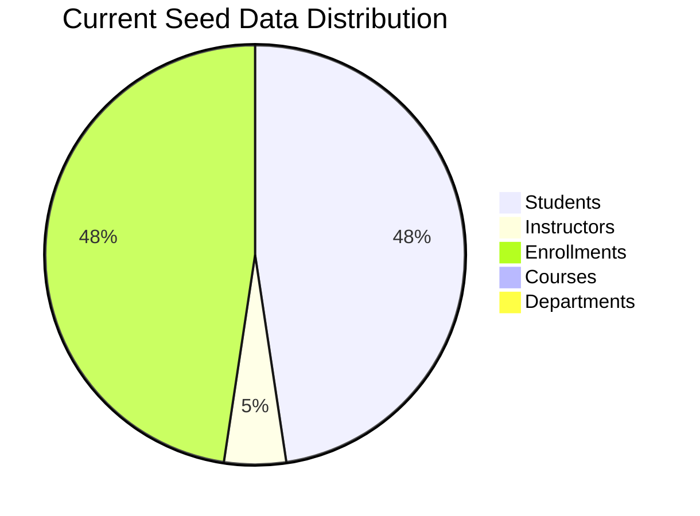
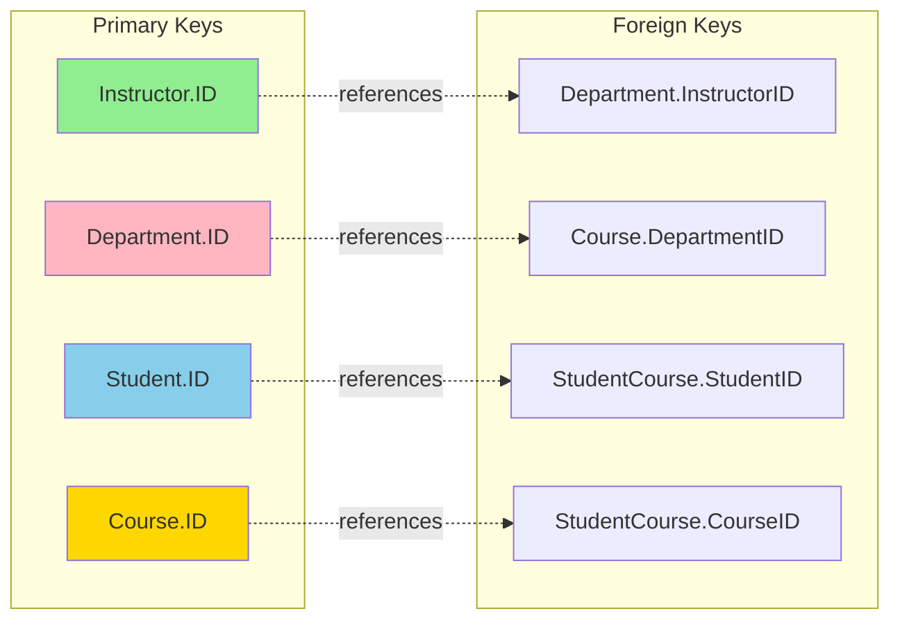
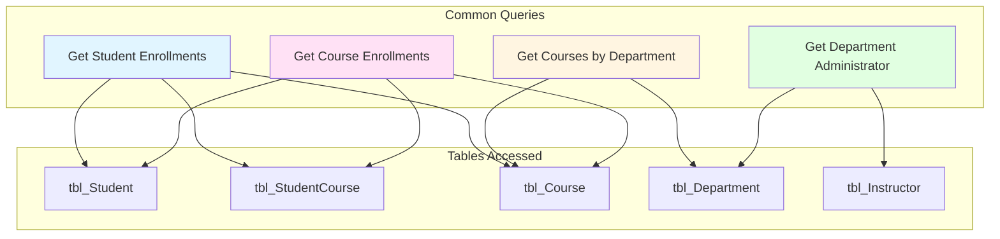
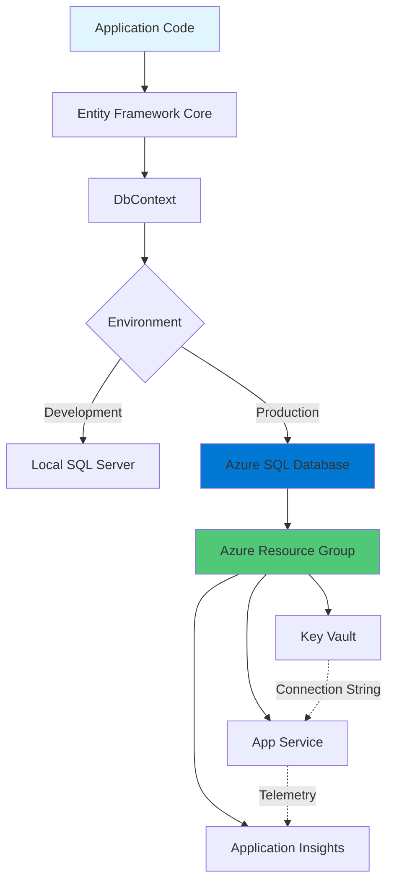

# Contoso University - Database Schema Diagrams

## Entity Relationship Diagram (ERD)

## Database Schema Overview

## Table Relationships Flow

## Detailed Schema with Constraints

## Data Flow During Initialization

## Query Performance Considerations

## Table Size and Growth Projection

## Foreign Key Constraints

## Data Access Patterns

## Database Deployment Architecture

## How to View These Diagrams

These diagrams are written in Mermaid syntax and can be viewed in:

1. **GitHub**: Automatically rendered in markdown files
2. **VS Code**: Install "Markdown Preview Mermaid Support" extension
3. **Online**: Copy/paste code to https://mermaid.live/
4. **Documentation Sites**: Most modern documentation platforms support Mermaid

## Diagram Legend

- **Solid Lines**: Direct relationships (foreign keys)
- **Dashed Lines**: Navigation properties (EF Core)
- **1:M**: One-to-Many relationship
- **M:M**: Many-to-Many relationship (via junction table)
- **PK**: Primary Key
- **FK**: Foreign Key

## Related Documentation

- [Full Database Schema Documentation](./DATABASE_SCHEMA.md)
- [Quick Reference Guide](./DATABASE_QUICK_REFERENCE.md)
