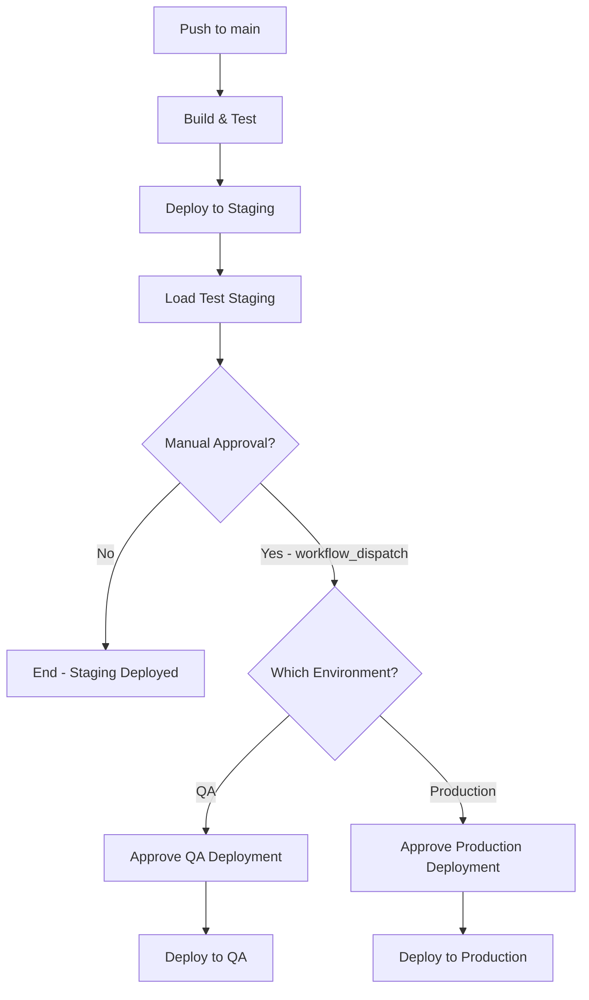

# Deployment Guide - Manual Approval Workflow

## Overview

The Contoso University deployment pipeline has been refactored to require **manual approval** for QA and Production deployments, while Staging deployments happen automatically on push to `main`.

## Deployment Strategy

| Environment | Trigger | Approval Required | Purpose |
|-------------|---------|-------------------|---------|
| **Staging** | Push to `main` | ❌ No | Default target for all merged PRs |
| **QA** | workflow_dispatch | ✅ Yes | Testing and validation |
| **Production** | workflow_dispatch | ✅ Yes | Production release |

### Workflow Behavior



## How to Deploy

### Automatic Deployment to Staging

**When:** Every push to `main` branch

1. Developer merges PR to `main`
2. CI pipeline runs automatically
3. Code is built and tested
4. **Deployment to Staging happens automatically**
5. Load tests run on Staging
6. ✅ Complete - Code is now in Staging

**No manual action required!**

### Manual Deployment to QA

**When:** You want to test in QA environment

1. Go to **Actions** tab in GitHub
2. Select **🚀 Enterprise Resilience Pipeline**
3. Click **Run workflow**
4. Select:
   - Branch: `main`
   - Environment: `qa`
   - Run load tests: `true` (recommended)
5. Click **Run workflow**
6. **Wait for approval notification**
7. Approver reviews and approves
8. Deployment proceeds to QA

### Manual Deployment to Production

**When:** You want to promote Staging to Production

**Prerequisites:**
- Code must already be deployed to Staging
- Load tests must have passed on Staging
- All required approvals must be obtained

**Steps:**

1. Go to **Actions** tab in GitHub
2. Select **🚀 Enterprise Resilience Pipeline**
3. Click **Run workflow**
4. Select:
   - Branch: `main`
   - Environment: `production`
   - Run load tests: `false` (already tested in Staging)
5. Click **Run workflow**
6. **Wait for approval notification**
7. Approver reviews and approves
8. Deployment proceeds to Production via slot swap
9. Health checks validate Production
10. Automatic rollback on failure

## GitHub Environment Configuration

To enable manual approvals, configure GitHub Environments:

### Setting Up QA Environment Protection

1. Go to **Settings** → **Environments**
2. Click **New environment** (or edit existing `qa`)
3. Add **Required reviewers**:
   - Add team members who can approve QA deployments
   - Recommend: QA lead, team lead
4. **Wait timer**: 0 minutes (optional: add delay if needed)
5. Save protection rules

### Setting Up Production Environment Protection

1. Go to **Settings** → **Environments**
2. Click **New environment** (or edit existing `production`)
3. Add **Required reviewers**:
   - Add senior team members who can approve Production
   - Recommend: Tech lead, product owner, SRE on-call
4. **Wait timer**: 0 minutes (optional: add delay for change freeze windows)
5. **Deployment branches**: Limit to `main` only
6. Save protection rules

### Staging Environment

- **No protection rules** - allows automatic deployment
- Staging is the proving ground before production

## Approval Workflow

### For Approvers

When a deployment requires your approval:

1. You'll receive a **notification email**
2. Go to the GitHub Actions run page
3. Review the changes:
   - Check the PR that triggered this
   - Review test results
   - Verify staging is healthy (if deploying to prod)
4. Click **Review deployments**
5. Select environment to approve
6. Add comment (optional but recommended)
7. Click **Approve and deploy**

### For Requesters

Best practices when requesting approval:

- Include context in the workflow run description
- Ensure all tests pass before requesting approval
- Have rollback plan ready
- Notify approvers via Slack/Teams
- Document any breaking changes

## Rollback Procedures

### Staging Rollback

```bash
# Option 1: Revert commit and push to main
git revert <commit-hash>
git push origin main

# Option 2: Re-run previous successful deployment
# Go to Actions → Find last good run → Re-run workflow
```

### QA Rollback

```bash
# Use workflow_dispatch to deploy previous version
# Actions → Run workflow → qa → (previous commit)
```

### Production Rollback

Production uses **slot swaps**, enabling instant rollback:

```bash
# Manual rollback via Azure Portal
az webapp deployment slot swap \
  --name $AZURE_WEBAPP_NAME \
  --resource-group $AZURE_RESOURCE_GROUP \
  --slot staging \
  --target-slot production
```

Or use the pipeline's **automatic rollback** on health check failure.

## Deployment Checklist

### Before Deploying to Staging (Automatic)
- ✅ All PR tests passed
- ✅ Code reviewed and approved
- ✅ No merge conflicts

### Before Requesting QA Approval
- ✅ Staging deployment successful
- ✅ Manual smoke test on Staging passed
- ✅ QA team notified
- ✅ Test data prepared in QA

### Before Requesting Production Approval
- ✅ Staging load tests passed
- ✅ Chaos tests passed (if applicable)
- ✅ No critical bugs in Staging
- ✅ Change advisory board approval (if required)
- ✅ Rollback plan documented
- ✅ On-call engineer aware
- ✅ Customer communication sent (if applicable)

## Environment Variables and Secrets

Each environment uses different secrets:

### Staging
- `AZURE_WEBAPP_NAME` (staging instance)
- `AZURE_SQL_CONNECTION_STRING` (staging DB)
- Lower-tier resources

### QA
- `AZURE_WEBAPP_NAME` (QA instance)
- `AZURE_SQL_CONNECTION_STRING` (QA DB)
- Test data, not production secrets

### Production
- `AZURE_WEBAPP_NAME` (production instance)
- `AZURE_SQL_CONNECTION_STRING` (production DB)
- **Never use production secrets in lower environments!**

## Monitoring and Alerts

### Staging
- Application Insights enabled
- Alerts on deployment failures
- Load test results visible

### QA
- Limited monitoring
- Manual validation primary

### Production
- Full Application Insights
- PagerDuty/Azure Monitor alerts
- Synthetic monitoring
- Automatic rollback on health check failure

## Troubleshooting

### Approval Not Showing Up

**Symptom:** Workflow runs but no approval prompt appears

**Solution:**
1. Check GitHub Environment protection rules are configured
2. Verify you're listed as a required reviewer
3. Ensure workflow uses correct `environment:` name

### Deployment Stuck "Waiting"

**Symptom:** Deployment waiting for approval indefinitely

**Solution:**
1. Check notification emails for approval request
2. Go to Actions → Click the run → Review deployments
3. If urgent, approvers can force approve

### Production Deployment Failed

**Symptom:** Production deployment fails after approval

**Solution:**
1. Check health check logs
2. Automatic rollback should trigger
3. If rollback fails, manual swap back to staging
4. Check Application Insights for errors
5. Run synthetic tests manually

## Best Practices

1. **Test in Staging first** - Always validate in staging before QA/Prod
2. **Small, frequent deployments** - Easier to rollback and debug
3. **Off-hours production deployments** - Minimize user impact
4. **Communication** - Notify stakeholders before production changes
5. **Monitor after deployment** - Watch metrics for 30+ minutes
6. **Document incidents** - Learn from deployment failures

## Questions?

Contact the SRE team or DevOps lead for:
- Approval access requests
- Environment configuration help
- Deployment troubleshooting
- Process improvements
