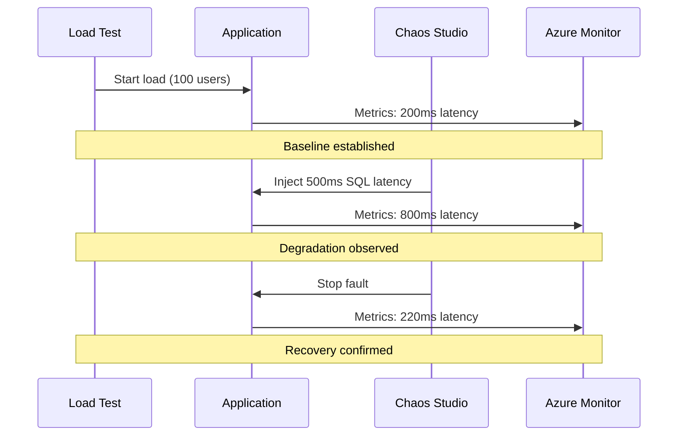

# 🔥 Azure Chaos Studio - Chaos Engineering

This folder contains Azure Chaos Studio experiments for testing the resilience of the Contoso University application.

## 📁 Structure

```
infra/chaos/
├── chaos-targets.bicep          # Enable chaos targets on resources
├── experiments/
│   ├── sql-latency.bicep        # SQL Database latency injection
│   └── cpu-pressure.bicep       # App Service CPU stress
└── README.md
```

## 🚀 Getting Started

### Prerequisites

1. **Azure Subscription** with Chaos Studio access
2. **Azure CLI** installed and authenticated
3. **Target Resources** deployed (App Service, SQL Database)

### Step 1: Register Chaos Studio Provider

```bash
az provider register --namespace Microsoft.Chaos
az provider show --namespace Microsoft.Chaos --query "registrationState"
```

### Step 2: Enable Chaos Targets

Deploy the chaos targets to enable fault injection on your resources:

```bash
az deployment group create \
  --resource-group rg-contoso-university \
  --template-file infra/chaos/chaos-targets.bicep \
  --parameters sqlDatabaseResourceId="/subscriptions/{sub}/resourceGroups/{rg}/providers/Microsoft.Sql/servers/{server}/databases/{db}" \
               appServiceResourceId="/subscriptions/{sub}/resourceGroups/{rg}/providers/Microsoft.Web/sites/{app}"
```

### Step 3: Deploy Experiments

**SQL Latency Experiment:**
```bash
az deployment group create \
  --resource-group rg-contoso-university \
  --template-file infra/chaos/experiments/sql-latency.bicep \
  --parameters sqlDatabaseResourceId="/subscriptions/{sub}/resourceGroups/{rg}/providers/Microsoft.Sql/servers/{server}/databases/{db}" \
               appServiceResourceId="/subscriptions/{sub}/resourceGroups/{rg}/providers/Microsoft.Web/sites/{app}"
```

**CPU Pressure Experiment:**
```bash
az deployment group create \
  --resource-group rg-contoso-university \
  --template-file infra/chaos/experiments/cpu-pressure.bicep \
  --parameters appServiceResourceId="/subscriptions/{sub}/resourceGroups/{rg}/providers/Microsoft.Web/sites/{app}"
```

## 🧪 Experiments

### 1. SQL Database Latency (`sql-latency.bicep`)

**Purpose:** Test application resilience when database queries are slow

**Fault Type:** Network latency injection

**Parameters:**
| Parameter | Default | Description |
|-----------|---------|-------------|
| `duration` | PT3M (3 min) | How long to inject latency |
| `latencyMs` | 500 | Milliseconds of delay to add |

**Expected Behavior:**
- ✅ Application should remain responsive
- ✅ Timeouts should be handled gracefully
- ✅ Circuit breaker should activate if available
- ⚠️ User experience may degrade but not fail

### 2. App Service CPU Pressure (`cpu-pressure.bicep`)

**Purpose:** Test application behavior under resource constraints

**Fault Type:** CPU stress

**Parameters:**
| Parameter | Default | Description |
|-----------|---------|-------------|
| `duration` | PT5M (5 min) | How long to stress CPU |
| `cpuPressurePercentage` | 80 | CPU utilization target |

**Expected Behavior:**
- ✅ Autoscaling should trigger (if configured)
- ✅ Health checks should detect degradation
- ✅ Response times will increase but app stays available
- ⚠️ May see increased error rates under extreme pressure

## 📊 Running Experiments

### Via Azure Portal

1. Navigate to **Azure Chaos Studio**
2. Select your experiment
3. Click **Start**
4. Monitor in the **Experiment details** tab

### Via Azure CLI

```bash
# Start experiment
az chaos experiment start \
  --name sql-latency-experiment \
  --resource-group rg-contoso-university

# Check status
az chaos experiment show \
  --name sql-latency-experiment \
  --resource-group rg-contoso-university \
  --query "properties.status"

# Cancel if needed
az chaos experiment cancel \
  --name sql-latency-experiment \
  --resource-group rg-contoso-university
```

### Via GitHub Actions

The CI/CD pipeline can run chaos experiments as a gate:

```yaml
- name: Start Chaos Experiment
  run: |
    az chaos experiment start \
      --name sql-latency-experiment \
      --resource-group ${{ secrets.AZURE_RESOURCE_GROUP }}
```

## 🛡️ Safety Controls

### Automatic Safeguards

1. **Duration Limits** - Experiments have maximum duration
2. **Blast Radius** - Only target specific resources
3. **Stop Conditions** - Can cancel experiments at any time

### Best Practices

1. **Start Small** - Begin with short durations
2. **Monitor Constantly** - Watch Azure Monitor during experiments
3. **Have Runbooks** - Know how to respond to issues
4. **Run in Staging First** - Validate before production

## 🔗 Integration with Load Testing

The most effective chaos testing combines with load testing:

1. **Start Load Test** - Generate realistic traffic
2. **Wait for Baseline** - Establish normal metrics
3. **Inject Fault** - Start chaos experiment
4. **Observe** - Monitor degradation and recovery
5. **Analyze** - Compare metrics before/during/after



## 📈 Metrics to Watch

During chaos experiments, monitor these in Azure Monitor:

| Metric | Normal | During Chaos | Action If Exceeded |
|--------|--------|--------------|-------------------|
| Response Time (p95) | < 500ms | < 2000ms | Stop experiment |
| Error Rate | < 0.1% | < 5% | Stop experiment |
| CPU Utilization | < 60% | < 95% | Expected with CPU chaos |
| Database DTU | < 50% | < 90% | May need scaling |

## 🔐 Permissions Required

The chaos experiment identity needs these roles:

| Resource | Role | Purpose |
|----------|------|---------|
| SQL Database | Contributor | Inject network faults |
| App Service | Contributor | Inject CPU/memory pressure |
| Resource Group | Reader | List resources |
